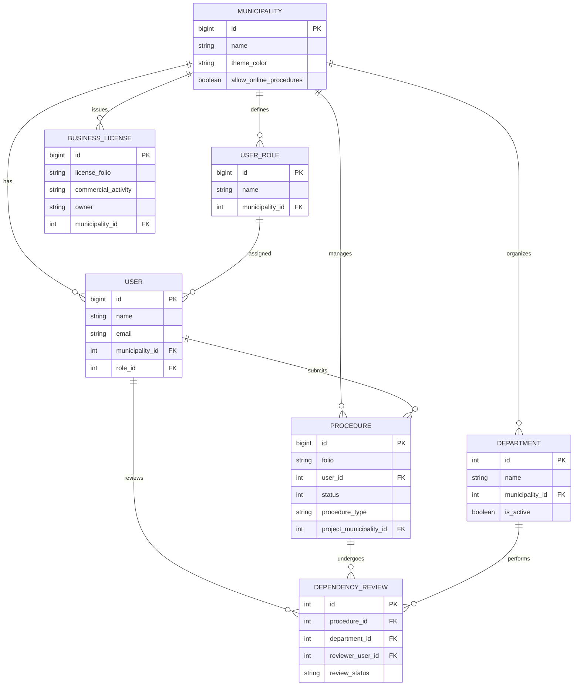
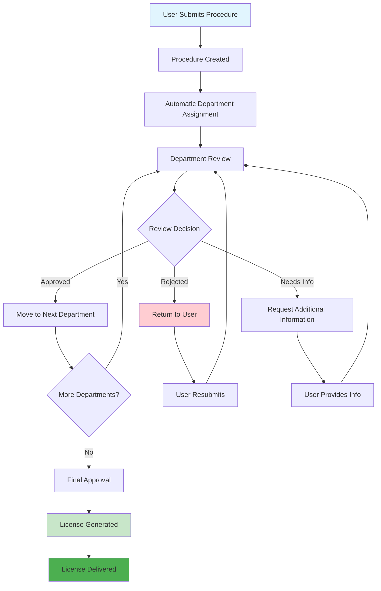
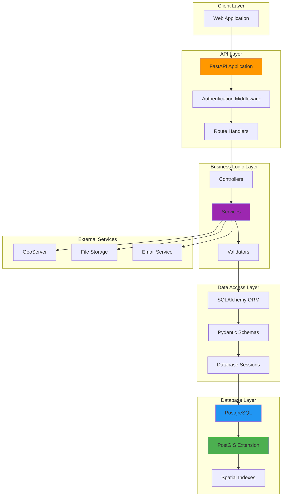

# Database Entity Relationship Diagram

## Complete Entity Relationship Diagram

```mermaid
erDiagram
    %% Core Entities
    MUNICIPALITY {
        bigint id PK
        string name
        string image
        string director
        string director_signature
        string address
        string phone
        string email
        string website
        string responsible_area
        boolean allow_online_procedures
        boolean allow_window_reviewer_licenses
        string low_impact_license_cost
        text license_additional_text
        string theme_color
        int process_sheet
        int solving_days
        int issue_license
        int window_license_generation
        text license_restrictions
        string license_price
        int initial_folio
        boolean has_zoning
        datetime created_at
        datetime updated_at
        datetime deleted_at
    }

    USER {
        bigint id PK
        string name
        string paternal_last_name
        string maternal_last_name
        string email
        string password
        string cellphone
        string user_tax_id
        string national_id
        string api_token
        datetime api_token_expiration
        int municipality_id FK
        int role_id FK
        int subrole_id FK
        string username
        boolean is_active
        boolean is_staff
        boolean is_superuser
        datetime created_at
        datetime updated_at
        datetime deleted_at
        datetime last_login
        datetime date_joined
    }

    USER_ROLE {
        bigint id PK
        string name
        string description
        int municipality_id FK
        datetime created_at
        datetime updated_at
        datetime deleted_at
    }

    SUB_ROLE {
        int id PK
        string name
        string description
        int municipality_id FK
        datetime created_at
        datetime updated_at
    }

    %% Procedure Management
    PROCEDURE {
        bigint id PK
        string folio
        int current_step
        string user_signature
        int user_id FK
        int window_user_id FK
        datetime documents_submission_date
        datetime procedure_start_date
        datetime license_delivered_date
        int status
        string procedure_type
        string license_status
        string reason
        int requirements_query_id FK
        string street
        string exterior_number
        string neighborhood
        int project_municipality_id FK
        datetime created_at
        datetime updated_at
    }

    PROCEDURE_REGISTRATION {
        int id PK
        string reference
        float area
        string business_sector
        string procedure_type
        string procedure_origin
        int historical_id
        string bbox
        geometry geom
        int municipality_id FK
    }

    REQUIREMENTS_QUERY {
        int id PK
        string name
        string description
        int municipality_id FK
        datetime created_at
        datetime updated_at
    }

    FIELD {
        bigint id PK
        string name
        string field_type
        text description
        text description_rec
        string rationale
        string options
        int step
        int sequence
        int required
        string visible_condition
        string procedure_type
        int municipality_id FK
        datetime created_at
        datetime updated_at
        datetime deleted_at
    }

    REQUIREMENT {
        bigint id PK
        int municipality_id FK
        int field_id FK
        string requirement_code
        datetime created_at
        datetime updated_at
    }

    ANSWER {
        bigint id PK
        int user_id FK
        int field_id FK
        text answer_text
        json answer_json
        datetime created_at
        datetime updated_at
    }

    %% Department System
    DEPARTMENT {
        int id PK
        string name
        text description
        string code
        int municipality_id FK
        boolean is_active
        boolean can_approve_procedures
        boolean can_reject_procedures
        datetime created_at
        datetime updated_at
        datetime deleted_at
    }

    DEPARTMENT_ROLE {
        int id PK
        int department_id FK
        int role_id FK
        int municipality_id FK
        boolean can_review_requirements
        boolean can_approve_department_review
        boolean can_reject_department_review
        boolean is_department_lead
        datetime created_at
        datetime updated_at
    }

    DEPARTMENT_USER_ASSIGNMENT {
        int id PK
        int department_id FK
        int user_id FK
        datetime assigned_at
        datetime unassigned_at
        boolean is_active
    }

    DEPENDENCY_REVIEW {
        int id PK
        int procedure_id FK
        int department_id FK
        int reviewer_user_id FK
        string review_status
        datetime review_date
        text comments
        datetime created_at
        datetime updated_at
    }

    DEPENDENCY_RESOLUTION {
        int id PK
        int dependency_review_id FK
        int resolved_by_user_id FK
        string resolution_status
        text resolution_notes
        datetime resolved_at
        datetime created_at
        datetime updated_at
    }

    %% Business License System
    BUSINESS_LICENSE {
        bigint id PK
        string owner
        string license_folio
        string commercial_activity
        string industry_classification_code
        string authorized_area
        string opening_time
        string closing_time
        string owner_last_name_p
        string owner_last_name_m
        string national_id
        text logo_image
        text signature
        text minimap_url
        int license_year
        int license_category
        int generated_by_user_id
        int payment_status
        datetime payment_date
        text payment_receipt_file
        int municipality_id FK
        datetime created_at
        datetime updated_at
        datetime deleted_at
    }

    BUSINESS_LICENSE_HISTORY {
        bigint id PK
        int business_license_id FK
        int municipality_id FK
        string change_type
        int changed_by_user_id
        datetime change_date
        json old_values
        json new_values
        text notes
        datetime created_at
    }

    BUSINESS_LICENSE_STATUS_LOG {
        bigint id PK
        int business_license_id FK
        string previous_status
        string new_status
        int changed_by_user_id
        datetime change_date
        text reason
        datetime created_at
    }

    PROVISIONAL_OPENING {
        bigint id PK
        string folio
        string business_name
        string owner_name
        string commercial_activity
        datetime opening_date
        datetime expiration_date
        string status
        int municipality_id FK
        datetime created_at
        datetime updated_at
    }

    %% Business Classification
    BUSINESS_SECTOR {
        int id PK
        string name
        string code
        text description
        datetime created_at
        datetime updated_at
    }

    BUSINESS_SECTOR_IMPACT {
        int id PK
        int business_sector_id FK
        string impact
        int municipality_id FK
        datetime created_at
        datetime updated_at
    }

    BUSINESS_SECTOR_CERTIFICATE {
        int id PK
        int business_sector_id FK
        string certificate_name
        boolean is_required
        int municipality_id FK
        datetime created_at
        datetime updated_at
    }

    BUSINESS_TYPE {
        int id PK
        string name
        string description
        boolean is_active
        string code
        string related_words
        datetime created_at
        datetime updated_at
    }

    BUSINESS_TYPE_CONFIG {
        int id PK
        int business_type_id FK
        int municipality_id FK
        boolean is_disabled
        boolean has_certificate
        int impact_level
        datetime created_at
        datetime updated_at
    }

    %% Geospatial Data
    MAP_LAYER {
        int id PK
        string value
        string label
        string type
        string url
        string layers
        boolean visible
        boolean active
        string attribution
        decimal opacity
        string server_type
        string projection
        string version
        string format
        int order
        boolean editable
        string type_geom
        string cql_filter
    }

    MAPLAYER_MUNICIPALITY {
        int maplayer_id PK, FK
        int municipality_id PK, FK
    }

    BUILDING_FOOTPRINT {
        int id PK
        geometry geom
        string building_type
        float area
        int municipality_id FK
        datetime created_at
        datetime updated_at
    }

    LAND_PARCEL_MAPPING {
        int id PK
        geometry geom
        string parcel_id
        string owner_name
        float area
        int municipality_id FK
        datetime created_at
        datetime updated_at
    }

    %% Zoning System
    ZONING_CONTROL_REGULATION {
        int id PK
        int municipality_id FK
        string zone_code
        text regulation_text
        datetime created_at
        datetime updated_at
    }

    URBAN_DEVELOPMENT_ZONING {
        int id PK
        string zone_name
        string zone_code
        text description
        text regulations
        datetime created_at
        datetime updated_at
    }

    ZONING_IMPACT_LEVEL {
        int id PK
        string level_name
        string level_code
        text description
        int priority
        int municipality_id FK
        datetime created_at
        datetime updated_at
    }

    %% Content Management
    BLOG {
        int id PK
        string title
        text content
        string slug
        int municipality_id FK
        datetime created_at
        datetime updated_at
    }

    TECHNICAL_SHEET {
        int id PK
        string name
        text description
        string file_path
        int municipality_id FK
        datetime created_at
        datetime updated_at
    }

    TECHNICAL_SHEET_DOWNLOAD {
        int id PK
        int technical_sheet_id FK
        int user_id FK
        datetime download_date
        string ip_address
    }

    %% Authentication Extensions
    CLIENT_TAX_ID {
        bigint id PK
        int user_id FK
        string tax_id
        datetime created_at
        datetime updated_at
    }

    USER_NATIONAL_ID {
        bigint id PK
        int user_id FK
        string national_id
        datetime created_at
        datetime updated_at
    }

    PASSWORD_RECOVERY {
        int id PK
        int user_id FK
        string token
        datetime expires_at
        boolean used
        datetime created_at
    }

    %% Additional System Tables
    USER_ROLE_ASSIGNMENT {
        bigint id PK
        bigint user_id FK
        bigint role_id FK
        int pending_role_id FK
        string role_status
        string token
        datetime created_at
        datetime updated_at
    }

    MUNICIPALITY_SIGNATURE {
        bigint id PK
        int municipality_id FK
        string signer_name
        string department
        int orden
        string signature
        datetime created_at
        datetime updated_at
    }

    %% Additional Critical Tables
    ANSWERS_JSON {
        bigint id PK
        int procedure_id FK
        int user_id FK
        json answers
        datetime created_at
        datetime updated_at
    }

    BUSINESS_LOGS {
        bigint id PK
        string action
        int user_id FK
        string previous_value
        int procedure_id FK
        string host
        string user_ip
        string post_request
        string device
        int log_type
        int role_id FK
        datetime created_at
        datetime updated_at
    }

    BUSINESS_LINES {
        int id PK
        string name
        datetime created_at
        datetime updated_at
    }

    BUSINESS_SIGNATURES {
        bigint id PK
        int business_license_id FK
        text signature_data
        datetime signed_at
        datetime created_at
        datetime updated_at
    }

    HISTORICAL_PROCEDURES {
        bigint id PK
        string folio
        int user_id FK
        string procedure_type
        datetime created_at
        datetime archived_at
    }

    NOTIFICATIONS {
        bigint id PK
        int user_id FK
        string title
        text message
        boolean is_read
        datetime created_at
        datetime updated_at
    }

    PASSWORD_RECOVERIES {
        int id PK
        int user_id FK
        string token
        datetime expires_at
        boolean used
        datetime created_at
        datetime updated_at
    }

    PREVENTION_REQUESTS {
        bigint id PK
        int procedure_id FK
        int reviewer_user_id FK
        text comments
        datetime requested_at
        datetime created_at
        datetime updated_at
    }

    REVIEWERS_CHAT {
        bigint id PK
        int procedure_id FK
        int user_id FK
        text message
        datetime sent_at
        datetime created_at
    }

    DIRECTOR_APPROVALS {
        bigint id PK
        int procedure_id FK
        int director_user_id FK
        boolean approved
        text comments
        datetime decision_date
        datetime created_at
    }

    MUNICIPALITY_GEOMS {
        bigint id PK
        bigint municipality_id FK
        string name
        string geom_type
        json coordinates
        datetime created_at
        datetime updated_at
    }

    BASE_NEIGHBORHOOD {
        int id PK
        string name
        string neighborhood_code
        geometry geom
        int locality_id FK
        int municipality_id FK
    }

    BLOCK_FOOTPRINTS {
        int id PK
        string block_code
        float area_m2
        geometry geom
        int neighborhood_id FK
    }

    WATER_BODY_FOOTPRINTS {
        int id PK
        float area_m2
        geometry geom
    }

    PUBLIC_SPACE_MAPPING {
        int id PK
        string name
        string space_type
        geometry geom
        datetime created_at
        datetime updated_at
    }

    ECONOMIC_ACTIVITY_BASE {
        int id PK
        string name
    }

    ECONOMIC_UNITS_DIRECTORY {
        bigint id PK
        string name
        string business_activity
        geometry geom
        int municipality_id FK
        int locality_id FK
        int economic_activity_id FK
    }

    PROCEDURE_DEPARTMENT_FLOWS {
        int id PK
        int procedure_id FK
        int department_id FK
        int order_index
        boolean is_completed
        datetime completed_at
    }

    DEPENDENCY_REVIEW_WORKFLOWS {
        int id PK
        int procedure_id FK
        int current_department_id FK
        int workflow_status
        datetime started_at
        datetime completed_at
    }

    REQUIREMENT_DEPARTMENT_ASSIGNMENTS {
        int id PK
        int requirement_id FK
        int department_id FK
        boolean is_required
        datetime created_at
    }

    PERMIT_RENEWALS {
        bigint id PK
        int business_license_id FK
        datetime renewal_date
        string status
        datetime created_at
        datetime updated_at
    }

    RENEWALS {
        bigint id PK
        int business_license_id FK
        datetime renewal_date
        string status
        datetime created_at
        datetime updated_at
    }

    INACTIVE_BUSINESSES {
        bigint id PK
        int business_line_id FK
        int municipality_id FK
        datetime created_at
        datetime updated_at
    }

    %% Relationships
    MUNICIPALITY ||--o{ USER : "has users"
    MUNICIPALITY ||--o{ USER_ROLE : "has roles"
    MUNICIPALITY ||--o{ SUB_ROLE : "has sub-roles"
    MUNICIPALITY ||--o{ PROCEDURE : "has procedures"
    MUNICIPALITY ||--o{ PROCEDURE_REGISTRATION : "has registrations"
    MUNICIPALITY ||--o{ REQUIREMENTS_QUERY : "has queries"
    MUNICIPALITY ||--o{ FIELD : "has fields"
    MUNICIPALITY ||--o{ REQUIREMENT : "has requirements"
    MUNICIPALITY ||--o{ DEPARTMENT : "has departments"
    MUNICIPALITY ||--o{ BUSINESS_LICENSE : "has licenses"
    MUNICIPALITY ||--o{ BUSINESS_LICENSE_HISTORY : "has license history"
    MUNICIPALITY ||--o{ PROVISIONAL_OPENING : "has provisional openings"
    MUNICIPALITY ||--o{ BUSINESS_SECTOR_IMPACT : "has sector impacts"
    MUNICIPALITY ||--o{ BUSINESS_SECTOR_CERTIFICATE : "has certificates"
    MUNICIPALITY ||--o{ BUSINESS_TYPE_CONFIG : "has type configs"
    MUNICIPALITY ||--o{ BUILDING_FOOTPRINT : "has building footprints"
    MUNICIPALITY ||--o{ LAND_PARCEL_MAPPING : "has land parcels"
    MUNICIPALITY ||--o{ ZONING_CONTROL_REGULATION : "has zoning regulations"
    MUNICIPALITY ||--o{ BLOG : "has blog posts"
    MUNICIPALITY ||--o{ TECHNICAL_SHEET : "has technical sheets"
    MUNICIPALITY ||--o{ MAP_LAYER : "has map layers"
    MUNICIPALITY ||--o{ USER_ROLE_ASSIGNMENT : "manages assignments"
    MUNICIPALITY ||--o{ MUNICIPALITY_SIGNATURE : "has signatures"
    MUNICIPALITY ||--o{ BUSINESS_TYPE_CONFIG : "configures business types"
    MUNICIPALITY ||--o{ ZONING_IMPACT_LEVEL : "defines impact levels"
    MUNICIPALITY ||--o{ BASE_LOCALITY : "contains localities"
    MUNICIPALITY ||--o{ ECONOMIC_UNITS_DIRECTORY : "registers businesses"
    MUNICIPALITY ||--o{ MUNICIPALITY_GEOMS : "has geometries"
    MUNICIPALITY ||--o{ NOTIFICATIONS : "sends notifications"
    MUNICIPALITY ||--o{ INACTIVE_BUSINESSES : "tracks inactive businesses"
    MUNICIPALITY ||--o{ BASE_NEIGHBORHOOD : "contains neighborhoods"

    USER ||--o{ PROCEDURE : "creates procedures"
    USER ||--o{ ANSWER : "provides answers"
    USER ||--o{ DEPENDENCY_REVIEW : "reviews procedures"
    USER ||--o{ DEPENDENCY_RESOLUTION : "resolves dependencies"
    USER ||--o{ BUSINESS_LICENSE_HISTORY : "changes licenses"
    USER ||--o{ BUSINESS_LICENSE_STATUS_LOG : "logs status changes"
    USER ||--o{ TECHNICAL_SHEET_DOWNLOAD : "downloads sheets"
    USER ||--o{ PASSWORD_RECOVERY : "recovers password"
    USER ||--o{ DEPARTMENT_USER_ASSIGNMENT : "assigned to departments"
    USER ||--o| CLIENT_TAX_ID : "has tax id"
    USER ||--o| USER_NATIONAL_ID : "has national id"
    USER ||--o{ USER_ROLE_ASSIGNMENT : "has role assignments"
    USER ||--o{ ANSWERS_JSON : "provides JSON answers"
    USER ||--o{ BUSINESS_LOGS : "generates logs"
    USER ||--o{ NOTIFICATIONS : "receives notifications"
    USER ||--o{ PASSWORD_RECOVERIES : "requests password recovery"
    USER ||--o{ REVIEWERS_CHAT : "participates in chat"
    USER ||--o{ DIRECTOR_APPROVALS : "makes director approvals"
    USER ||--o{ PREVENTION_REQUESTS : "creates prevention requests"

    USER_ROLE ||--o{ USER : "assigned to users"
    USER_ROLE ||--o{ DEPARTMENT_ROLE : "assigned to departments"
    SUB_ROLE ||--o{ USER : "assigned to users"

    PROCEDURE ||--o{ DEPENDENCY_REVIEW : "has reviews"
    PROCEDURE ||--|| REQUIREMENTS_QUERY : "uses query"
    PROCEDURE ||--o{ ANSWERS_JSON : "has JSON answers"
    PROCEDURE ||--o{ BUSINESS_LOGS : "generates logs"
    PROCEDURE ||--o{ HISTORICAL_PROCEDURES : "archived as"
    PROCEDURE ||--o{ PREVENTION_REQUESTS : "has prevention requests"
    PROCEDURE ||--o{ REVIEWERS_CHAT : "has chat messages"
    PROCEDURE ||--o{ DIRECTOR_APPROVALS : "requires director approval"
    PROCEDURE ||--o{ PROCEDURE_DEPARTMENT_FLOWS : "follows department flows"
    PROCEDURE ||--o{ DEPENDENCY_REVIEW_WORKFLOWS : "follows review workflows"

    FIELD ||--o{ REQUIREMENT : "has requirements"
    FIELD ||--o{ ANSWER : "has answers"

    DEPARTMENT ||--o{ DEPARTMENT_ROLE : "has roles"
    DEPARTMENT ||--o{ DEPARTMENT_USER_ASSIGNMENT : "has users"
    DEPARTMENT ||--o{ DEPENDENCY_REVIEW : "performs reviews"
    DEPARTMENT ||--o{ PROCEDURE_DEPARTMENT_FLOWS : "participates in flows"
    DEPARTMENT ||--o{ DEPENDENCY_REVIEW_WORKFLOWS : "manages workflows"
    DEPARTMENT ||--o{ REQUIREMENT_DEPARTMENT_ASSIGNMENTS : "assigned requirements"

    DEPENDENCY_REVIEW ||--o{ DEPENDENCY_RESOLUTION : "has resolutions"

    BUSINESS_LICENSE ||--o{ BUSINESS_LICENSE_HISTORY : "has history"
    BUSINESS_LICENSE ||--o{ BUSINESS_LICENSE_STATUS_LOG : "has status logs"
    BUSINESS_LICENSE ||--o{ BUSINESS_SIGNATURES : "has signatures"
    BUSINESS_LICENSE ||--o{ PERMIT_RENEWALS : "has renewals"
    BUSINESS_LICENSE ||--o{ RENEWALS : "requires renewals"

    BUSINESS_SECTOR ||--o{ BUSINESS_SECTOR_IMPACT : "has impacts"
    BUSINESS_SECTOR ||--o{ BUSINESS_SECTOR_CERTIFICATE : "has certificates"

    BUSINESS_TYPE ||--o{ BUSINESS_TYPE_CONFIG : "has configs"

    MAP_LAYER ||--o{ MAPLAYER_MUNICIPALITY : "associated with"
    MUNICIPALITY ||--o{ MAPLAYER_MUNICIPALITY : "associated with"

    TECHNICAL_SHEET ||--o{ TECHNICAL_SHEET_DOWNLOAD : "has downloads"
```

## Simplified Core Entity Diagram



## Workflow Process Diagram



## Data Flow Architecture



---
