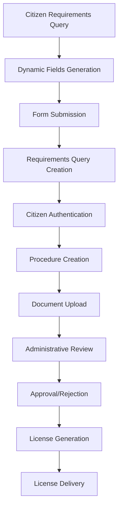
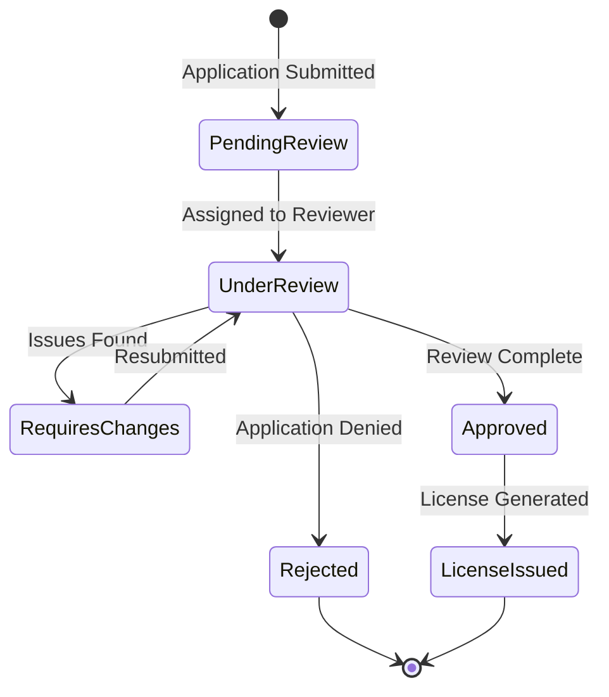

# Visor Urbano: Complete License Workflow Guide

This comprehensive guide explains how the license application process works in Visor Urbano from both citizen and administrative perspectives, including detailed routes, components, endpoints, and data flow.

## Table of Contents

1. [System Overview](#system-overview)
2. [Key Components & Architecture](#key-components--architecture)
3. [Citizen User Journey](#citizen-user-journey)
4. [Administrative User Journey](#administrative-user-journey)
5. [API Endpoints Reference](#api-endpoints-reference)
6. [Database Schema](#database-schema)
7. [Frontend Components](#frontend-components)
8. [Backend Services](#backend-services)
9. [File Upload & Management](#file-upload--management)
10. [License Generation & Issuance](#license-generation--issuance)

---

## System Overview

Visor Urbano is a comprehensive municipal permit and license management system that streamlines the application process for citizens and provides efficient review and approval workflows for municipal staff.

### Core System Flow



---

## Key Components & Architecture

### 1. Requirements Query System

The process begins with **Requirements Queries** (`requirements_querys` table), which serve as the foundation for all license applications.

**Key Models:**

- `RequirementsQuery` - Base application data
- `Field` - Dynamic form fields
- `Requirement` - Field requirements by municipality
- `Answer` - User responses to dynamic fields

**Core Flow:**

1. User visits property information page
2. System generates dynamic fields based on municipality and license type
3. User fills form with property and business information
4. System creates `RequirementsQuery` record with unique folio
5. Dynamic field answers stored in `Answer` table

### 2. Dynamic Fields System

The system uses a flexible field configuration that adapts based on:

- Municipality requirements
- License type (commercial/construction)
- Business activity (SCIAN code)
- Property characteristics

**Field Types:**

- `input` - Text input
- `textarea` - Multi-line text
- `select` - Dropdown selection
- `radio` - Radio buttons
- `file` - File upload
- `multifile` - Multiple file upload

### 3. Procedure Management

Once a citizen authenticates and validates their folio, a `Procedure` record is created that links to the `RequirementsQuery`.

---

## Citizen User Journey

### Phase 1: Property Information & Requirements Discovery

**Route:** `/property-info` or `/`

**Components:**

- `PropertyInfo.tsx` - Main property information form
- `DynamicFieldRenderer.tsx` - Renders dynamic form fields
- `RequirementsModal.tsx` - Shows generated requirements

**API Endpoints:**

```
POST /v1/requirements-queries/requirements
GET /v1/fields/municipality/{municipality_id}
```

**Process:**

1. **Property Selection**
   - User locates property on map or enters address
   - System identifies municipality
   - User selects license type (commercial/construction)

2. **Business Information**
   - Business activity (SCIAN code selection)
   - Property details (area, address)
   - Applicant information
   - Specific business characteristics (alcohol sales, etc.)

3. **Dynamic Fields Population**
   - System fetches municipality-specific fields
   - Fields filtered by license type and business activity
   - Form renders with conditional logic and validation

4. **Requirements Generation**
   ```javascript
   // Frontend field processing
   const handleFormSubmit = async formData => {
     const requirementsQuery = await createRequirementsQueryWithDynamicFields({
       municipality_id: municipalityId,
       license_type: licenseType,
       dynamic_fields: formData,
       // ... other property data
     });

     // Generates folio and requirements list
     showRequirementsModal(requirementsQuery);
   };
   ```

**Backend Processing:**

```python
# apps/backend/app/services/requirements_queries.py
async def submit_requirements_query_with_dynamic_fields(
    data: RequirementsQueryCreateWithDynamicFieldsSchema,
    db: AsyncSession
):
    # Generate unique folio
    folio = f"{municipality_id}-{count}/{year}"

    # Create RequirementsQuery record
    new_query = RequirementsQuery(**base_fields)
    db.add(new_query)

    # Store dynamic field answers
    for field_name, field_value in data.dynamic_fields.items():
        answer = Answer(
            requirements_query_id=new_query.id,
            name=field_name,
            value=str(field_value)
        )
        db.add(answer)

    return requirements_response
```

### Phase 2: Application Submission

**Route:** `/procedures/new`

**Process:**

1. **Folio Validation**

   ```typescript
   // Validate folio exists and get procedure requirements
   const folioValidation = await validateFolio(authToken, folio);
   ```

2. **Procedure Creation**

   ```
   PUT /v1/requirements/validate/folio/{requirements_query_id}
   ```

   Backend creates `Procedure` record linking to `RequirementsQuery`:

   ```python
   new_procedure = Procedure(
       folio=requirements_query.folio,
       current_step=0,
       user_id=current_user.id,
       requirements_query_id=requirements_query_id,
       status=1,  # Pending review
       # ... copy data from requirements_query
   )
   ```

### Phase 3: Form Completion & Document Upload

**Route:** `/procedures/{folio}/edit`

**Components:**

- `ProcedureEditPage.tsx` - Main editing interface
- `DynamicFieldRenderer.tsx` - Field rendering with file upload
- `FileUploadComponent.tsx` - Document management

**Process:**

1. **Load Dynamic Fields**

   ```
   GET /v1/fields/by_folio/{encoded_folio}
   ```

2. **Step-by-Step Form Completion**
   - Step 1: Basic information
   - Step 2+: Dynamic fields organized by sections
   - File uploads for required documents

3. **File Upload Process**

   ```typescript
   const uploadFile = async (file: File, fieldName: string) => {
     const formData = new FormData();
     formData.append('files', file);
     formData.append('field_names', fieldName);

     const result = await uploadProcedureFile(
       authToken,
       folio,
       fieldName,
       file
     );
     // Stores file metadata in Answer table
   };
   ```

4. **Form Submission**
   ```
   PUT /v1/procedures/{procedure_id}/answers
   ```

### Phase 4: Tracking & Status Updates

**Route:** `/procedures/{folio}/detail`

**Features:**

- Real-time status tracking
- Document review status
- Communication with reviewers
- License download (when available)

---

## Administrative User Journey

### Phase 1: Application Review Queue

**Route:** `/procedure-approvals`

**User Roles:**

- **Municipal Staff** (role_id > 1): Review applications
- **Reviewers**: Technical review and validation
- **Directors**: Final approval authority

**Process:**

1. **Application Filtering**

   ```typescript
   // Filter by type, status, and assignment
   const procedures = await getProcedures(authToken, {
     municipality_id: user.municipality_id,
     status: filterStatus,
     tab_filter: selectedTab, // business_licenses, permits_building_license, etc.
   });
   ```

2. **Review Assignment**
   - Applications automatically assigned based on type and municipality
   - Reviewers can claim applications or have them assigned
   - Workload balancing across review staff

### Phase 2: Application Review

**Route:** `/procedures/{folio}/detail` (Administrative view)

**Review Process:**

1. **Document Verification**
   - Review all uploaded documents
   - Verify completeness and compliance
   - Request additional documentation if needed

2. **Field Inspection (if required)**
   - Schedule on-site inspections
   - Upload inspection reports
   - Update compliance status

3. **Technical Review**
   - Validate technical specifications
   - Check zoning compliance
   - Verify safety requirements

**Status Updates:**

```
POST /v1/procedures/approve/{encoded_folio}
POST /v1/procedures/reject/{encoded_folio}
```

### Phase 3: Approval & License Generation

**Two License Generation Methods:**

#### Method 1: Upload Scanned License

```
POST /v1/procedures/issue-license/{encoded_folio}
```

**Process:**

1. Director uploads pre-signed physical license
2. System creates `BusinessLicense` record
3. Links scanned PDF to procedure
4. Updates procedure status to "License Issued"

#### Method 2: System-Generated License

```
POST /v1/procedures/generate-license/{encoded_folio}
```

**Process:**

1. System generates license using templates
2. Includes electronic signatures from municipality
3. Creates PDF with all required information
4. Automatically marks as issued

**Backend License Creation:**

```python
# Create business license record
business_license = BusinessLicense(
    owner=procedure.official_applicant_name,
    license_folio=folio,
    commercial_activity=procedure.scian_name,
    opening_time=opening_time,
    closing_time=closing_time,
    authorized_area=authorized_area,
    municipality_id=procedure.municipality_id,
    generated_by_user_id=current_user.id,
    license_status="issued",
    procedure_id=procedure.id
)
```

### Phase 4: License Management

**Route:** `/licenses-issued`

**Features:**

- View all issued licenses
- Manage payment status
- Upload payment receipts
- Track license delivery
- Generate reports

---

## API Endpoints Reference

### Requirements Queries

```
POST /v1/requirements-queries/                     # Create basic requirements query
POST /v1/requirements-queries/requirements         # Create with dynamic fields
GET  /v1/requirements-queries/{folio}/info         # Get procedure information
GET  /v1/requirements-queries/{folio}/requirements/{id}/pdf  # Generate requirements PDF
```

### Fields & Dynamic Forms

```
GET  /v1/fields/municipality/{municipality_id}     # Get municipality fields
GET  /v1/fields/by_folio/{encoded_folio}          # Get fields for specific procedure
POST /v1/fields/toggle_requirement                 # Toggle field requirements
```

### Procedures

```
GET  /v1/procedures/                               # List user procedures
GET  /v1/procedures/{procedure_id}                 # Get specific procedure
PUT  /v1/procedures/{procedure_id}/answers         # Update procedure answers
POST /v1/procedures/upload_documents/{encoded_folio} # Upload documents
PUT  /v1/requirements/validate/folio/{req_query_id} # Validate folio and create procedure
```

### Administrative Actions

```
GET  /v1/procedures/approvals                      # List pending approvals
POST /v1/procedures/approve/{encoded_folio}        # Approve procedure
POST /v1/procedures/reject/{encoded_folio}         # Reject procedure
POST /v1/procedures/issue-license/{encoded_folio}  # Issue scanned license
POST /v1/procedures/generate-license/{encoded_folio} # Generate system license
```

### License Management

```
GET  /v1/procedures/licenses-issued                # List issued licenses
GET  /v1/procedures/license/status/{encoded_folio} # Get license status
GET  /v1/procedures/license/download/{encoded_folio} # Download license PDF
```

---

## Database Schema

### Core Tables

#### requirements_querys

```sql
id                  BIGINT PRIMARY KEY
folio               VARCHAR(255)           # Unique application identifier
street              VARCHAR(100)           # Property address
neighborhood        VARCHAR(100)
municipality_id     INTEGER                # FK to municipalities
scian_code          VARCHAR(100)           # Business activity code
scian_name          VARCHAR(100)           # Business activity name
property_area       DECIMAL(12,2)          # Property size
activity_area       DECIMAL(12,2)          # Business operation area
applicant_name      VARCHAR(100)           # Applicant information
person_type         VARCHAR(100)           # Legal person type
alcohol_sales       INTEGER                # Alcohol sales indicator
license_type        VARCHAR(50)            # 'commercial' or 'construction'
status              INTEGER                # Application status
user_id             INTEGER                # Associated user (initially 0)
created_at          DATETIME
```

#### procedures

```sql
id                     BIGINT PRIMARY KEY
folio                  VARCHAR(255)        # Links to requirements_query
current_step           INTEGER             # Application progress
status                 INTEGER             # 1=pending, 2=approved, 3=rejected, 7=license_issued
requirements_query_id  INTEGER             # FK to requirements_querys
user_id               INTEGER             # FK to users (citizen)
window_user_id        INTEGER             # FK to users (municipal staff)
procedure_type        VARCHAR(255)        # business_license, construction_permit, etc.
license_status        VARCHAR(255)        # License generation status
license_pdf           VARCHAR(255)        # Path to license file
director_approval     INTEGER             # Legacy approval flag
sent_to_reviewers     INTEGER             # Review assignment status
created_at            DATETIME
```

#### fields

```sql
id                    INTEGER PRIMARY KEY
name                  VARCHAR(100)        # Field identifier
field_type           VARCHAR(50)         # input, file, select, etc.
description          VARCHAR(255)        # Field label
description_rec      TEXT                # Detailed description
rationale            TEXT                # Legal basis
options              TEXT                # Select/radio options
sequence             INTEGER             # Display order
required             INTEGER             # 0=optional, 1=required
municipality_id      INTEGER             # FK to municipalities
step                 INTEGER             # Form step (1-4)
procedure_type       VARCHAR(100)        # business_license, permits_building_license
visible_condition    VARCHAR(255)        # Conditional display logic
```

#### answers

```sql
id                    BIGINT PRIMARY KEY
procedure_id          INTEGER             # FK to procedures
requirements_query_id INTEGER             # FK to requirements_querys (for pre-auth answers)
name                  VARCHAR(255)        # Field name
value                 TEXT                # User response
user_id               INTEGER             # FK to users
status                INTEGER             # Answer status
created_at            DATETIME
```

#### business_licenses

```sql
id                    BIGINT PRIMARY KEY
license_folio         VARCHAR(255)        # Unique license number
owner                 VARCHAR(255)        # License holder
commercial_activity   VARCHAR(255)        # Business type
opening_time          VARCHAR(50)         # Operating hours
closing_time          VARCHAR(50)
authorized_area       VARCHAR(100)        # Permitted area
scanned_pdf           VARCHAR(500)        # License file path
license_status        VARCHAR(255)        # issued, revoked, etc.
payment_status        INTEGER             # 0=unpaid, 1=paid
procedure_id          INTEGER             # FK to procedures
municipality_id       INTEGER             # FK to municipalities
generated_by_user_id  INTEGER             # FK to users (issuing official)
```

---

## Frontend Components

### Core Route Components

#### PropertyInfo.tsx

- **Location:** `apps/frontend/app/components/PropertyInfo/PropertyInfo.tsx`
- **Purpose:** Initial requirements gathering form
- **Key Features:**
  - Map integration for property selection
  - Dynamic field rendering based on municipality
  - License type selection (commercial/construction)
  - SCIAN code lookup for business activities
  - Conditional field display logic

#### ProcedureEditPage.tsx

- **Location:** `apps/frontend/app/routes/procedures/edit.tsx`
- **Purpose:** Complete application form with document uploads
- **Key Features:**
  - Multi-step form navigation
  - Dynamic field rendering with validation
  - File upload with progress tracking
  - Form state management and auto-save
  - Step completion tracking

#### ProcedureDetailPage.tsx

- **Location:** `apps/frontend/app/routes/procedures/detail.tsx`
- **Purpose:** View application status and download licenses
- **Key Features:**
  - Real-time status display
  - Document gallery with download links
  - License download when available
  - Status history and timeline

#### ProcedureApprovals.tsx

- **Location:** `apps/frontend/app/routes/procedure-approvals.tsx`
- **Purpose:** Administrative review interface
- **Key Features:**
  - Application filtering and search
  - Bulk actions for approval/rejection
  - License issuance modal
  - Status update tracking

### Utility Components

#### DynamicFieldRenderer.tsx

- **Location:** `apps/frontend/app/components/DynamicField/DynamicFieldRenderer.tsx`
- **Purpose:** Renders form fields based on configuration
- **Supported Types:**
  - Text inputs with validation
  - File uploads with progress
  - Select dropdowns with options
  - Radio button groups
  - Textarea fields
  - Conditional field display

---

## Backend Services

### RequirementsQueriesService

- **Location:** `apps/backend/app/services/requirements_queries.py`
- **Key Methods:**
  - `submit_requirements_query_with_dynamic_fields()` - Process initial application
  - `get_procedure_info()` - Retrieve application data
  - `get_requirements_pdf()` - Generate requirements document
  - `_process_dynamic_requirements()` - Handle dynamic field processing

### Procedure Management

- **Location:** `apps/backend/app/routers/procedures.py`
- **Key Endpoints:**
  - Procedure CRUD operations
  - Status update management
  - Document upload handling
  - License generation and issuance
  - Administrative approval workflows

### Field Management

- **Location:** `apps/backend/app/routers/public_fields.py`
- **Key Functions:**
  - Dynamic field configuration
  - Municipality-specific requirements
  - Field-answer association
  - Conditional logic processing

---

## File Upload & Management

### File Upload Process

1. **Frontend Upload**

   ```typescript
   // Upload file to procedure
   const uploadResult = await uploadProcedureFile(
     authToken,
     folio,
     fieldName,
     file
   );
   ```

2. **Backend Processing**

   ```python
   @procedures.post("/upload_documents/{encoded_folio}")
   async def upload_procedure_documents(
       encoded_folio: str,
       files: List[UploadFile],
       field_names: List[str],
       # ...
   ):
       # Validate file types and sizes
       # Store files in uploads directory
       # Create Answer records with file metadata
   ```

3. **File Storage Structure**
   ```
   uploads/
   ├── procedures/
   │   ├── {folio}/
   │   │   ├── {field_name}_{timestamp}.pdf
   │   │   └── {field_name}_{timestamp}.jpg
   └── licenses/
       ├── {license_folio}.pdf
       └── receipts/
           └── {license_folio}_receipt.pdf
   ```

### File Types & Validation

**Allowed Extensions:** `.pdf`, `.jpg`, `.jpeg`, `.png`, `.doc`, `.docx`
**Maximum Size:** 15MB per file
**Validation Rules:**

- File type verification by content and extension
- Virus scanning (configurable)
- File naming conventions for organization

---

## License Generation & Issuance

### System-Generated Licenses

The system can automatically generate licenses using HTML templates converted to PDF:

1. **Template Processing**

   ```python
   # Load Jinja2 template
   template = env.get_template("business_license_template.html")
   html_content = template.render(**template_data)

   # Convert to PDF
   pdf_buffer = HTML(string=html_content).write_pdf()
   ```

2. **License Data Compilation**
   - Procedure information
   - Applicant details
   - Business activity information
   - Municipal signatures
   - Legal references and conditions

3. **Electronic Signatures**
   - Municipal officials' electronic signatures
   - Department stamps and seals
   - QR codes for verification

### License Delivery Process

1. **License Generation/Upload**
2. **System Notifications**
   - Email notification to applicant
   - SMS notification (if configured)
   - Portal notification

3. **Download Portal**
   - Secure download links
   - License verification
   - Digital signature validation

---

## Status Flow & State Management

### Application Status Codes

```javascript
const STATUS_CODES = {
  1: 'pending_review', // Initial submission
  2: 'approved', // Director approved
  3: 'rejected', // Application rejected
  4: 'under_review', // Active review
  5: 'requires_changes', // Needs modifications
  6: 'inspection_required', // Site inspection needed
  7: 'license_issued', // License generated/issued
};
```

### Workflow States

1. **Initial Submission** (Status 1)
   - Application received
   - Basic validation passed
   - Assigned to review queue

2. **Under Review** (Status 4)
   - Assigned to reviewer
   - Document verification in progress
   - May require additional documentation

3. **Approved** (Status 2)
   - All requirements met
   - Director approval received
   - Ready for license generation

4. **License Issued** (Status 7)
   - License generated or uploaded
   - Available for download
   - Process complete

### State Transitions



---

## Integration Points

### External Systems

1. **GIS/Mapping Integration**
   - Property location services
   - Zoning verification
   - Spatial analysis for restrictions

2. **Payment Processing**
   - Municipal payment gateways
   - Fee calculation engines
   - Receipt management

3. **Document Management**
   - Electronic document storage
   - Version control
   - Audit trails

4. **Notification Services**
   - Email notifications
   - SMS services
   - Push notifications

### API Authentication

All API endpoints require JWT authentication:

```javascript
headers: {
  'Authorization': `Bearer ${accessToken}`,
  'Content-Type': 'application/json'
}
```

Role-based access control ensures appropriate permissions for each user type.

---

## Error Handling & Validation

### Frontend Validation

1. **Form Validation**
   - Real-time field validation
   - Required field checking
   - Format validation (email, phone, etc.)
   - File type and size validation

2. **Error Display**
   - Inline field errors
   - Form-level error summaries
   - Toast notifications for system errors

### Backend Validation

1. **Request Validation**
   - Pydantic schema validation
   - Business rule enforcement
   - Data integrity checks

2. **Error Responses**
   ```python
   # Structured error responses
   {
     "detail": "Error description",
     "error_code": "VALIDATION_ERROR",
     "field_errors": {
       "field_name": ["Error message"]
     }
   }
   ```

---

## Performance Considerations

### Database Optimization

1. **Indexing Strategy**
   - Folio lookups
   - Status filtering
   - Municipality-based queries

2. **Query Optimization**
   - Eager loading for related data
   - Pagination for large result sets
   - Caching for static data

### File Handling

1. **Storage Optimization**
   - File compression for documents
   - CDN integration for downloads
   - Cleanup policies for temporary files

2. **Upload Performance**
   - Chunked upload for large files
   - Progress tracking
   - Background processing for virus scanning

---

## Security Measures

### Data Protection

1. **Access Control**
   - Role-based permissions
   - Municipality data isolation
   - User session management

2. **File Security**
   - Secure file upload validation
   - Virus scanning
   - Access logging and audit trails

### API Security

1. **Authentication**
   - JWT token validation
   - Token expiration handling
   - Refresh token mechanism

2. **Authorization**
   - Endpoint-level permissions
   - Resource ownership validation
   - Administrative privilege checks
