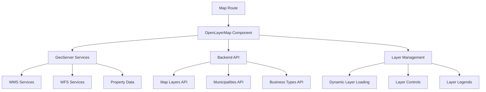

# Visor Urbano: Map Route Documentation

This comprehensive documentation explains the Map route (`/map`) in Visor Urbano, covering GeoServer integration, layer management, map interactivity, data sources, and the complete mapping architecture.

## Table of Contents

1. [Route Overview](#route-overview)
2. [Architecture & Data Flow](#architecture--data-flow)
3. [GeoServer Integration](#geoserver-integration)
4. [Map Layers System](#map-layers-system)
5. [OpenLayers Implementation](#openlayers-implementation)
6. [Map Interactivity](#map-interactivity)
7. [Property Data System](#property-data-system)
8. [Backend vs GeoServer Data](#backend-vs-geoserver-data)
9. [Models & Schemas](#models--schemas)
10. [State Management](#state-management)
11. [Tool System](#tool-system)
12. [File Upload & Geometry Processing](#file-upload--geometry-processing)
13. [Environment Configuration](#environment-configuration)
14. [Performance & Optimization](#performance--optimization)

---

## Route Overview

The Map route (`/apps/frontend/app/routes/map.tsx`) is the central mapping interface of Visor Urbano, providing an interactive map for property visualization, geographic analysis, and procedure management.

### Key Features

- **Interactive OpenLayers Map** with WMS/WFS layer support
- **GeoServer Integration** for geospatial data services
- **Dynamic Property Information** display and analysis
- **Layer Management** with visibility controls and legends
- **Drawing & Measurement Tools** for geometry creation
- **File Upload Support** for KML, KMZ, GeoJSON, and Shapefile
- **Address Search & Geocoding** integration
- **Municipality-specific Layer Loading**

### Route Parameters

```typescript
// URL Parameters supported
?point=lon lat              // Display point on map
?polygon=base64encodedData   // Display polygon on map
?address=street_address      // Search for address
?municipality=municipality_name // Filter by municipality
```

---

## Architecture & Data Flow

### High-Level Architecture



### Data Flow Sequence

1. **Route Initialization**
   - Load environment configuration
   - Fetch map layers from backend
   - Parse URL parameters for initial state
   - Query GeoServer for property/state data

2. **Layer Loading**
   - Retrieve municipality-specific layers
   - Configure WMS tile layers
   - Set up vector layers for interactions
   - Apply layer styling and filtering

3. **User Interactions**
   - Map clicks trigger feature queries
   - Tool selection enables drawing/measuring
   - Layer toggles update visibility
   - Search updates map location

---

## GeoServer Integration

### GeoServer Configuration

The system integrates with GeoServer for geospatial data services using standardized OGC protocols.

#### Environment Variables

```typescript
// Environment configuration in map.tsx loader
ENV: {
  GEOSERVER_URL: process.env.GEOSERVER_URL,
  MAP_CENTER_LAT: process.env.MAP_CENTER_LAT,
  MAP_CENTER_LON: process.env.MAP_CENTER_LON,
  MAP_MUNICIPIO_LAYER: process.env.MAP_MUNICIPIO_LAYER,
  MAP_TILE_CENTER_X: process.env.MAP_TILE_CENTER_X,
  MAP_TILE_CENTER_Y: process.env.MAP_TILE_CENTER_Y,
}
```

#### GeoServer Services Used

**1. WMS (Web Map Service)**

- **Purpose**: Tile generation and map rendering
- **Usage**: Background layers, styled map overlays
- **Example**: `{GEOSERVER_URL}/ows?service=WMS&request=GetMap`

**2. WFS (Web Feature Service)**

- **Purpose**: Vector data queries and feature access
- **Usage**: Property boundaries, feature information
- **Example**: `{GEOSERVER_URL}/ows?service=WFS&request=GetFeature`

**3. WMS GetFeatureInfo**

- **Purpose**: Click-based feature information retrieval
- **Usage**: Layer info dialog, property details
- **Example**: `{GEOSERVER_URL}/ows?service=WMS&request=GetFeatureInfo`

### GeoServer Utility Functions

**Location**: `/apps/frontend/app/utils/map/map.ts`

#### Core GeoServer Functions

```typescript
// Generate GeoServer URL with parameters
function generateGeoServerURL(
  params: WMSGetMapParams | WFSGetFeatureParams
): string;

// Fetch data from GeoServer services
export async function fetchGeoServer(params: GeoServerParams): Promise<any>;

// Get property data from WFS response
export async function getPropertyData(
  response: Record<string, unknown>,
  overridePolygon?: number[][]
): Promise<PropertyData>;

// Generate minimap URL for property previews
function urlMinimap(
  bbox: number[],
  id: string | null,
  overridePolygon?: number[][]
): string;
```

#### WMS Parameter Configuration

```typescript
interface WMSGetMapParams {
  BBOX: `${number},${number},${number},${number}`;
  cql_filter: string;
  CRS: 'EPSG:4326';
  exceptions: 'application/vnd.ogc.se_inimage';
  FORMAT: 'image/png8';
  height: number;
  layers: string;
  request: 'GetMap';
  service: 'WMS';
  styles: string;
  version: '1.3.0';
  width: number;
}
```

#### WFS Parameter Configuration

```typescript
interface WFSGetFeatureParams {
  service: 'WFS';
  request: 'GetFeature';
  version: '2.0.0';
  typename: string;
  count?: number;
  outputFormat: 'application/json';
  cql_filter?: string;
}
```

### Property Data Query Process

1. **Map Click/Point Selection**

   ```typescript
   // Transform coordinates to GeoServer projection
   const [lon, lat] = point.split(' ').map(Number);
   const transformed = fromLonLat([lon, lat], 'EPSG:32613');
   queryPoint = `${transformed[0]} ${transformed[1]}`;
   ```

2. **GeoServer Query**

   ```typescript
   const property = fetchGeoServer({
     geoServerURL: process.env.GEOSERVER_URL,
     service: 'WFS',
     request: 'GetFeature',
     version: '2.0.0',
     typename: `${process.env.MAP_PREDIOS_LAYER}`,
     count: 1,
     outputFormat: 'application/json',
     cql_filter: `CONTAINS(geom, POINT (${queryPoint}))`,
   });
   ```

3. **Data Processing**
   ```typescript
   const data = await getPropertyData(response, polygonFromUrl);
   const dynamicFields = await getDynamicFields(
     data.municipalityId ?? 2,
     'all'
   );
   ```

---

## Map Layers System

### Database Model: MapLayer

**Location**: `/apps/backend/app/models/map_layers.py`

```python
class MapLayer(Base):
    __tablename__ = 'map_layers'

    id = Column(Integer, primary_key=True, autoincrement=True)
    value = Column(String(100), nullable=False)           # Layer identifier
    label = Column(String(180), nullable=False)           # Display name
    type = Column(String(20), nullable=False)             # WMS/WFS
    url = Column(String(255), nullable=False)             # GeoServer URL
    layers = Column(String(60), nullable=False)           # Layer names
    visible = Column(Boolean, default=True)               # Default visibility
    active = Column(Boolean, default=True)                # Layer enabled
    attribution = Column(String(100), nullable=True)      # Copyright text
    opacity = Column(DECIMAL(3, 2))                       # Layer opacity
    server_type = Column(String(60), nullable=True)       # geoserver/mapserver
    projection = Column(String(20), default='EPSG:4326')  # Coordinate system
    version = Column(String(10), default='1.3.0')         # Service version
    format = Column(String(60), nullable=False)           # image/png
    order = Column(Integer, default=0)                    # Display order
    editable = Column(Boolean, default=True)              # User can edit
    type_geom = Column(String(20), nullable=True)         # Geometry type
    cql_filter = Column(String(255), nullable=True)       # Server filter

    # Many-to-many relationship with municipalities
    municipalities = relationship("Municipality",
                                secondary=maplayer_municipality,
                                back_populates="map_layers")
```

### Layer Configuration Examples

**Seeded Layer Data** (from `/apps/backend/scripts/seed_map_layers.py`):

```python
{
    "id": 6,
    "value": "chih_zonif_primaria2023_corregida",
    "label": "Zonificación primaria (2023)",
    "type": "wms",
    "url": "https://datahub.mpiochih.gob.mx/ows",
    "layers": "chih_zonif_primaria2023_corregida",
    "visible": False,
    "active": True,
    "attribution": None,
    "opacity": 1,
    "server_type": None,
    "projection": "EPSG:32613",
    "version": "1.3.0",
    "format": "image/png",
    "order": 1,
    "editable": True,
    "type_geom": None,
    "cql_filter": None,
    "municipality": [2]  # Chihuahua municipality
}
```

### Layer Types & Categories

**Available Layer Categories:**

1. **Base Layers**
   - Orthophoto imagery (`chihuhuaOrto2020`)
   - OpenStreetMap base layer

2. **Zoning Layers**
   - Primary zoning (`chih_zonif_primaria2023_corregida`)
   - Secondary zoning (`zon_secundaria_dissolve_utmz13n`)
   - Modified land uses (`usos_modificados_2024`)

3. **Infrastructure Layers**
   - Road structure (`chih_estructura_vial2023_corregida`)
   - Streets (`chih_calles_implan`)
   - Buildings (`chih_construcciones`)

4. **Urban Planning Layers**
   - Strategic nodes (`nodos_estrategicos_2023`)
   - Specific planning (`planeacion_especifica_2023`)
   - Urban equipment priority zones (`zprioritaria_equrbano_2023`)

5. **Environmental & Risk Layers**
   - Risk management (`gestion_de_riesgos_2023`)
   - Industrial reserves (`reservas_industriales_2023`)

6. **Administrative Layers**
   - Urban properties (`predio_urbano`)
   - Census data (`chih_cpv2020_manzanas`)
   - DENUE business directory (`chih_denue_nov2024`)

### API Endpoints for Layers

**Backend Router**: `/apps/backend/app/routers/map_layers.py`

```python
# List layers (with optional municipality filter)
@router.get("/", response_model=List[MapLayerResponse])
async def list_map_layers(
    municipality: Optional[int] = Query(None),
    db: AsyncSession = Depends(get_db)
)

# Get specific layer
@router.get("/{id}", response_model=MapLayerResponse)
async def get_map_layer(id: int, db: AsyncSession = Depends(get_db))

# Create new layer
@router.post("/", response_model=MapLayerResponse, status_code=201)
async def create_map_layer(data: MapLayerCreate, db: AsyncSession = Depends(get_db))

# Update layer
@router.patch("/{id}", response_model=MapLayerResponse)
async def update_map_layer(id: int, data: MapLayerUpdate, db: AsyncSession = Depends(get_db))
```

### Frontend Layer Loading

**Location**: `/apps/frontend/app/utils/api/map_layers.ts`

```typescript
export async function getMapLayers({ municipality }: { municipality: number }) {
  return requestAPI({
    endpoint: 'v1/map_layers',
    data: { municipality },
  }).then(response => {
    const result = MapLayersSchema.safeParse(response);

    if (result.success) {
      // Sort layers by order property
      const sortedLayers = result.data.sort((a, b) => a.order - b.order);
      return sortedLayers;
    }
    return undefined;
  });
}
```

---

## OpenLayers Implementation

### Component Structure

**Main Component**: `/apps/frontend/app/components/OpenLayerMap/OpenLayerMap.tsx`

The OpenLayers implementation uses a sophisticated projection system and layer management:

#### Projection Configuration

```typescript
// Define EPSG:32613 (WGS 84 / UTM zone 13N) projection
proj4.defs('EPSG:32613', '+proj=utm +zone=13 +datum=WGS84 +units=m +no_defs');
register(proj4);
```

#### Layer Creation Process

```typescript
// Create WMS tile layers from backend configuration
tiles.current = layersFromProps
  .map(layer => {
    const tile = new TileLayer({
      properties: { id: layer.id },
      source: new TileWMS({
        attributions: layer.attribution ?? undefined,
        url: layer.url,
        params: {
          LAYERS: layer.layers,
          TILED: true,
          FORMAT: layer.format,
          SRS: layer.projection,
          CRS: layer.projection,
          VERSION: layer.version,
          CQL_FILTER: layer.cql_filter,
        },
        serverType: (layer.server_type as ServerType) ?? undefined,
      }),
      visible: layer.visible !== false,
    });

    tile.setOpacity(Number(layer.opacity) || 1);
    return tile;
  })
  .filter(layer => layer !== null);
```

#### Map Initialization

```typescript
map.current = new Map({
  target: mapContainer.current,
  layers: [
    new TileLayer({
      source: new OSM(), // Base OpenStreetMap layer
    }),
    ...layers, // State/municipality boundaries
    ...tiles.current, // WMS layers from backend
    drawVectorLayer, // Drawing layer
    measureVectorLayer, // Measurement layer
    searchVectorLayer, // Search results layer
  ],
  view: new View({
    center: center
      ? transform([center.lon, center.lat], 'EPSG:4326', 'EPSG:32613')
      : [0, 0],
    zoom: 7,
    projection: 'EPSG:32613',
  }),
});
```

### Layer Management

#### Dynamic Layer Visibility

```typescript
useEffect(() => {
  if (tiles.current) {
    tiles.current.forEach(tile => {
      const id = tile.getProperties().id;
      const newVisibility = layersFromProps.find(layer => layer.id === id);
      tile.setVisible(newVisibility?.visible ?? true);
    });
  }
}, [layersFromProps]);
```

#### Custom Vector Layers

```typescript
useEffect(() => {
  if (map.current) {
    // Remove existing custom layers
    customLayers.current.forEach(layer => {
      map.current?.removeLayer(layer);
    });
    customLayers.current = [];

    // Add new custom layers
    customVectorLayers.forEach(layer => {
      map.current?.addLayer(layer);
      customLayers.current.push(layer);
    });
  }
}, [customVectorLayers]);
```

---

## Map Interactivity

### Click Handling System

The map supports different types of interactions based on the selected tool:

#### Feature Selection

```typescript
map.current.on('click', event => {
  if (!map.current) return;

  // Get features at clicked pixel
  const featuresAtPixel = map.current.getFeaturesAtPixel(event.pixel);

  let clickData = {
    coordinate: event.coordinate,
    tool: toolRef.current,
    feature: undefined,
  };

  // Check if we clicked on a feature
  if (featuresAtPixel.length > 0) {
    const feature = featuresAtPixel[0];
    const properties = feature.getProperties();

    clickData.feature = {
      properties,
      layerType: layer.get('type') ?? 'vector',
      layerId: layer.get('id') ?? 'unknown',
    };
  }

  onMapClick?.(clickData);
});
```

#### Layer Information Queries

```typescript
// Query visible layers for information at click point
const visibleLayers = state.layers?.filter(layer => layer.visible) || [];
const coordinates = action.payload.coordinates;

const [lon, lat] = toLonLat(coordinates, 'EPSG:32613');
const tolerance = 0.0001;
const bbox = `${lat - tolerance},${lon - tolerance},${lat + tolerance},${lon + tolerance}`;

const fetchPromises = visibleLayers.map(async layer => {
  const data = await fetchGeoServer({
    geoServerURL: loaderData.ENV.GEOSERVER_URL,
    SERVICE: 'WMS',
    VERSION: '1.3.0',
    REQUEST: 'GetFeatureInfo',
    FORMAT: 'image/png',
    TRANSPARENT: 'true',
    QUERY_LAYERS: layer.layers,
    LAYERS: layer.layers,
    SRS: layer.projection,
    CRS: 'EPSG:4326',
    INFO_FORMAT: 'application/json',
    FEATURE_COUNT: 10,
    BBOX: bbox,
  });

  return { layerName: layer.label, data: data?.features?.[0]?.properties };
});
```

### Municipality Detection

```typescript
function moveHandler({ map, geoServerURL, municipioLayer, onFeatureLoad }) {
  const center = map?.getView().getCenter();

  if (center) {
    fetchGeoServer({
      geoServerURL,
      service: 'WFS',
      request: 'GetFeature',
      version: '2.0.0',
      typename: municipioLayer,
      count: 1,
      outputFormat: 'application/json',
      cql_filter: `CONTAINS(geom, POINT (${center[0]} ${center[1]}))`,
    }).then(data => {
      if (data.features?.[0]?.properties?.nom_mun) {
        onFeatureLoad({ name: data.features[0].properties.nom_mun });
      }
    });
  }
}
```

---

## Property Data System

### Property Information Display

When a user clicks on the map or provides URL parameters, the system displays detailed property information.

#### Property Data Structure

```typescript
interface PropertyData {
  id: string;
  municipalityId: number;
  municipalityName: string;
  address: string;
  coordinates: string;
  squareMeters: number;
  geometry: GeoJSON.Feature;
  businessTypes: BusinessType[];
  dynamicFields: DynamicField[];
  minimap?: string;
}
```

#### Property Query Process

1. **Coordinate Transformation**

   ```typescript
   // Point coordinates from map click (EPSG:4326)
   const [lon, lat] = point.split(' ').map(Number);
   // Transform to local SRS for GeoServer query
   const transformed = fromLonLat([lon, lat], 'EPSG:32613');
   queryPoint = `${transformed[0]} ${transformed[1]}`;
   ```

2. **GeoServer Property Query**

   ```typescript
   property = fetchGeoServer({
     geoServerURL: process.env.GEOSERVER_URL,
     service: 'WFS',
     request: 'GetFeature',
     version: '2.0.0',
     typename: `${process.env.MAP_PREDIOS_LAYER}`,
     count: 1,
     outputFormat: 'application/json',
     cql_filter: `CONTAINS(geom, POINT (${queryPoint}))`,
   });
   ```

3. **Data Enhancement**

   ```typescript
   const data = await getPropertyData(response, polygonFromUrl);

   // Add business types for the municipality
   data.businessTypes = data.municipalityId
     ? await getBusinessTypes({ municipality_id: data.municipalityId })
     : [];

   // Add dynamic fields for form generation
   data.dynamicFields = await getDynamicFields(data.municipalityId ?? 2, 'all');
   ```

#### PropertyInfo Component

**Location**: `/apps/frontend/app/components/PropertyInfo/PropertyInfo.tsx`

The PropertyInfo component displays:

- Property address and location details
- Zoning information
- Area calculations
- Available business types
- Dynamic form fields for license applications
- Requirements generation functionality

---

## Backend vs GeoServer Data

### Data Source Separation

The system separates concerns between the backend database and GeoServer:

#### Backend Database Provides:

- **Map Layer Configurations** (`map_layers` table)
  - Layer metadata, URLs, styling
  - Municipality associations
  - Display order and permissions
- **Business Logic Data**
  - User procedures and applications
  - Business types and classifications
  - Dynamic field configurations
  - Requirements and workflow states

- **Administrative Data**
  - Users, roles, and permissions
  - Municipalities and their settings
  - Application status and history

#### GeoServer Provides:

- **Geospatial Data Services**
  - Property boundaries and cadastral data
  - Zoning layer geometries
  - Infrastructure mapping data
  - Administrative boundaries

- **Map Rendering Services**
  - WMS tile generation
  - Styled map overlays
  - Legend generation
  - Spatial query capabilities

### Integration Points

**1. Layer Configuration Flow**

```
Backend Database (map_layers) → Frontend → OpenLayers → GeoServer (WMS/WFS)
```

**2. Property Information Flow**

```
Map Click → GeoServer (WFS Query) → Property Data → Backend (Business Types, Fields)
```

**3. Municipality Detection Flow**

```
Map Movement → GeoServer (Municipality Layer) → Municipality ID → Backend (Layer Filtering)
```

---

## Models & Schemas

### Frontend Schemas

**Location**: `/apps/frontend/app/schemas/map-layers.ts`

```typescript
export const MapLayerSchema = z.object({
  id: z.number(),
  value: z.string(),
  label: z.string(),
  type: z.string(),
  url: z.string(),
  layers: z.string(),
  visible: z.boolean(),
  active: z.boolean(),
  attribution: z.string().nullable(),
  opacity: z.number(),
  server_type: z.string().nullable(),
  projection: z.string(),
  version: z.string(),
  format: z.string(),
  order: z.number(),
  editable: z.boolean(),
  type_geom: z.string().nullable(),
  cql_filter: z.string().nullable(),
  municipality_ids: z.array(z.number()),
});

export const MapLayersSchema = z.array(MapLayerSchema);
```

### Backend Schemas

**Location**: `/apps/backend/app/schemas/map_layers.py`

```python
class MapLayerBase(BaseModel):
    value: str
    label: str
    type: str
    url: str
    layers: str
    visible: Optional[bool] = True
    active: Optional[bool] = True
    attribution: Optional[str] = None
    opacity: Optional[float] = 1.0
    server_type: Optional[str] = None
    projection: Optional[str] = "EPSG:4326"
    version: Optional[str] = "1.3.0"
    format: str
    order: Optional[int] = 0
    editable: Optional[bool] = True
    type_geom: Optional[str] = None
    cql_filter: Optional[str] = None

class MapLayerCreate(MapLayerBase):
    municipality_ids: Optional[List[int]] = []

class MapLayerUpdate(BaseModel):
    value: Optional[str] = None
    label: Optional[str] = None
    type: Optional[str] = None
    url: Optional[str] = None
    layers: Optional[str] = None
    visible: Optional[bool] = None
    active: Optional[bool] = None
    attribution: Optional[str] = None
    opacity: Optional[float] = None
    server_type: Optional[str] = None
    projection: Optional[str] = None
    version: Optional[str] = None
    format: Optional[str] = None
    order: Optional[int] = None
    editable: Optional[bool] = None
    type_geom: Optional[str] = None
    cql_filter: Optional[str] = None
    municipality_ids: Optional[List[int]] = None

class MapLayerResponse(MapLayerBase):
    id: int
    municipality_ids: List[int] = []
```

---

## State Management

### Map State Structure

The map route uses a sophisticated state management system with reducers:

```typescript
type State = {
  layers: Awaited<ReturnType<typeof loader>>['layers'];
  mode: (typeof asideOptions)[number]['id'] | null;
  selectedTool: ComponentProps<typeof OpenLayerMap>['tool'];
  showInfo: boolean;
  showMapControls: boolean;
  pendingPoint?: string;
  layerInfoData: { layerName: string; data: unknown }[] | null;
  showLayerInfoDialog: boolean;
  showUploadDialog: boolean;
  uploadStep: 'disclaimer' | 'file-selection';
  uploadProcessing: boolean;
  uploadError: string | null;
};
```

### State Actions

```typescript
type Actions =
  | { type: 'SET_TOOL'; payload: State['selectedTool'] }
  | { type: 'SET_MODE'; payload: State['mode'] }
  | { type: 'MAP_CLICK'; payload: { coordinates: number[] } }
  | { type: 'SET_SHOW_INFO'; payload: boolean }
  | { type: 'TOGGLE_LAYER'; payload: { id: number } }
  | { type: 'TOGGLE_SHOW_MAP_CONTROLS' }
  | {
      type: 'SET_LAYER_INFO_DATA';
      payload: { layerName: string; data: unknown }[];
    }
  | { type: 'SET_SHOW_LAYER_INFO_DIALOG'; payload: boolean }
  | { type: 'SET_SHOW_UPLOAD_DIALOG'; payload: boolean }
  | { type: 'SET_UPLOAD_STEP'; payload: State['uploadStep'] }
  | { type: 'SET_UPLOAD_PROCESSING'; payload: boolean }
  | { type: 'SET_UPLOAD_ERROR'; payload: string | null };
```

### Layer State Management

```typescript
case 'TOGGLE_LAYER': {
  const updatedLayers = state.layers?.map(layer => {
    if (layer.id === action.payload.id) {
      return { ...layer, visible: !layer.visible };
    }
    return layer;
  });

  return { ...state, layers: updatedLayers };
}
```

---

## Tool System

### Available Tools

The map supports various interactive tools for different use cases:

```typescript
const tools = [
  {
    id: 'select',
    icon: <MapPin size={16} />,
    label: 'controls.tools.tabs.tools.list.select',
  },
  {
    id: 'draw',
    icon: <Pencil size={16} />,
    label: 'controls.tools.tabs.tools.list.draw',
  },
  {
    id: 'measure-lineal',
    icon: <Ruler size={16} />,
    label: 'controls.tools.tabs.tools.list.measure-lineal',
  },
  {
    id: 'measure-area',
    icon: <DraftingCompass size={16} />,
    label: 'controls.tools.tabs.tools.list.measure-area',
  },
  {
    id: 'info',
    icon: <Info size={16} />,
    label: 'controls.tools.tabs.tools.list.info',
  },
] as const;
```

### Tool Implementation

#### Selection Tool

- **Purpose**: Click to select properties and display information
- **Behavior**: Triggers property queries and shows PropertyInfo panel

#### Drawing Tool

- **Purpose**: Create polygon geometries for property definition
- **Behavior**: Enables polygon drawing with OpenLayers Draw interaction
- **Output**: Saves geometry to URL parameters and triggers property search

#### Measurement Tools

- **Purpose**: Measure distances and areas on the map
- **Types**: Linear measurement and area measurement
- **Display**: Shows measurement tooltips with formatted values

#### Info Tool

- **Purpose**: Query layer information at clicked points
- **Behavior**: Fetches feature info from all visible layers
- **Display**: Shows layer information dialog with detailed data

### Tool State Management

```typescript
useEffect(() => {
  if (tool === 'clear' && map.current) {
    // Clear all drawings and measurements
    drawSourceRef.current.clear();
    measureSourceRef.current.clear();
    searchSourceRef.current.clear();

    // Remove all tooltips and overlays
    tooltips.current.forEach(overlay => map.current?.removeOverlay(overlay));
    measureTooltips.current.forEach(overlay =>
      map.current?.removeOverlay(overlay)
    );

    // Reset arrays
    tooltips.current = [];
    measureTooltips.current = [];
    return;
  }

  // Tool-specific drawing configuration
  const draw = new Draw({
    source: tool === 'draw' ? drawSourceRef.current : measureSourceRef.current,
    type:
      tool && ['measure-area', 'draw'].includes(tool)
        ? 'Polygon'
        : 'LineString',
    style: toolStyle,
  });

  // Add interaction to map
  if (map.current && tool !== 'select' && tool !== 'info') {
    map.current.addInteraction(draw);
  }
}, [tool]);
```

---

## File Upload & Geometry Processing

### Supported File Formats

The map supports uploading various geospatial file formats:

- **KML/KMZ Files** - Google Earth format
- **GeoJSON Files** - Standard web mapping format
- **Shapefiles** - ESRI Shapefile format (as ZIP)

### Upload Process

#### File Upload Dialog

```typescript
const handleFileUpload = async (file: File) => {
  dispatch({ type: 'SET_UPLOAD_PROCESSING', payload: true });
  dispatch({ type: 'SET_UPLOAD_ERROR', payload: null });

  const result = await processUploadedFile(file);

  if ('message' in result) {
    // Error case
    dispatch({ type: 'SET_UPLOAD_ERROR', payload: result.message });
  } else {
    // Success case - update map with new geometry
    setSearchParams(searchParams => {
      searchParams.set('polygon', result.polygonBase64);
      searchParams.delete('point');
      return searchParams;
    });

    dispatch({ type: 'SET_SHOW_UPLOAD_DIALOG', payload: false });
    setSelectedFile(null);
  }

  dispatch({ type: 'SET_UPLOAD_PROCESSING', payload: false });
};
```

#### File Processing

**Location**: `/apps/frontend/app/utils/fileProcessing/fileProcessing.ts`

The file processing utility handles:

1. **File Type Detection** - Based on extension and content
2. **Format Conversion** - Convert to GeoJSON standard
3. **Coordinate Transformation** - Ensure proper projection
4. **Geometry Validation** - Check for valid geometries
5. **Base64 Encoding** - For URL parameter storage

### Geometry Handling

#### Polygon Encoding/Decoding

```typescript
// Encode polygon coordinates to base64 for URL storage
export function encodePolygonToBase64(coordinates: number[][]): string;

// Decode base64 polygon data from URL parameters
export function decodePolygonFromBase64(encoded: string): number[][];

// Get polygon center point for map centering
export function getPolygonCenter(coordinates: number[][]): number[] | null;
```

#### Drawing Events

```typescript
draw.on('drawend', event => {
  const feature = event.feature;
  const geometry = feature.getGeometry();

  if (geometry instanceof Polygon) {
    const coordinates = geometry.getCoordinates()[0];

    // Transform to WGS84 for storage
    const wgs84Coordinates = coordinates.map((coord: number[]) => {
      return toLonLat(coord, 'EPSG:32613');
    });

    const polygonGeometry = {
      type: 'Polygon' as const,
      coordinates: [wgs84Coordinates],
    };

    // Update URL with new polygon
    setSearchParams(searchParams => {
      searchParams.set('polygon', encodePolygonToBase64(wgs84Coordinates));
      searchParams.delete('point');
      return searchParams;
    });

    // Trigger callback
    onDrawEnd?.(polygonGeometry);
  }
});
```

---

## Environment Configuration

### Required Environment Variables

```bash
# GeoServer Configuration
GEOSERVER_URL=https://datahub.mpiochih.gob.mx/ows
MAP_PREDIOS_LAYER=predio_urbano
MAP_MUNICIPIO_LAYER=municipio_layer
MAP_ESTADO_LAYER=estado_layer
MAP_ESTADO_CQL_FILTER=estado='Chihuahua'

# Map Center Configuration (Chihuahua)
MAP_CENTER_LAT=28.6353
MAP_CENTER_LON=-106.0889

# Map Tile Configuration
MAP_TILE_CENTER_X=128
MAP_TILE_CENTER_Y=128

# Layer Styling
MAP_CROQUIS_BASE=base_layer
MAP_CROQUIS_BASE_STYLE=base_style
MAP_CROQUIS_PREDIO_STYLE=predio_style
```

### Layer Configuration

Layers are configured through the database seeder:

**Location**: `/apps/backend/scripts/seed_map_layers.py`

```python
# Example layer configuration
{
    "id": 6,
    "value": "chih_zonif_primaria2023_corregida",
    "label": "Zonificación primaria (2023)",
    "type": "wms",
    "url": "https://datahub.mpiochih.gob.mx/ows",
    "layers": "chih_zonif_primaria2023_corregida",
    "visible": False,
    "active": True,
    "attribution": None,
    "opacity": 1,
    "server_type": None,
    "projection": "EPSG:32613",
    "version": "1.3.0",
    "format": "image/png",
    "order": 1,
    "editable": True,
    "type_geom": None,
    "cql_filter": None,
    "municipality": [2]  # Associated with Chihuahua
}
```

---

## Performance & Optimization

### Layer Loading Optimization

1. **Municipality-Based Filtering**

   ```typescript
   // Only load layers for current municipality
   layers = await getMapLayers({ municipality: 2 });
   ```

2. **Layer Ordering**

   ```typescript
   // Sort layers by display order
   const sortedLayers = result.data.sort((a, b) => a.order - b.order);
   ```

3. **Lazy Loading**
   - Layers load only when municipality is determined
   - Property data loads only on user interaction

### GeoServer Query Optimization

1. **Feature Count Limiting**

   ```typescript
   // Limit results for performance
   count: 1,
   ```

2. **CQL Filter Usage**

   ```typescript
   // Server-side filtering
   cql_filter: `CONTAINS(geom, POINT (${queryPoint}))`;
   ```

3. **Projection Optimization**
   ```typescript
   // Use local projection for accurate queries
   const transformed = fromLonLat([lon, lat], 'EPSG:32613');
   ```

### Memory Management

1. **Layer Cleanup**

   ```typescript
   // Remove layers when component unmounts
   customLayers.current.forEach(layer => {
     map.current?.removeLayer(layer);
   });
   customLayers.current = [];
   ```

2. **Tooltip Management**
   ```typescript
   // Clean up measurement tooltips
   measureTooltips.current.forEach(overlay => {
     map.current?.removeOverlay(overlay);
   });
   measureTooltipElements.current.forEach(el => {
     el.remove();
   });
   ```

### Error Handling

1. **GeoServer Connection**

   ```typescript
   try {
     layers = await getMapLayers({ municipality: 2 });
   } catch (error) {
     console.error('Error fetching map layers:', error);
   }
   ```

2. **Geometry Processing**
   ```typescript
   .map(feature => {
     try {
       return new GeoJSON().readFeatures(feature);
     } catch (error) {
       console.warn('Failed to read GeoJSON feature:', error);
       return [];
     }
   })
   ```

---

## Integration with License Workflow

The map route integrates closely with the license application workflow:

### Property Selection Flow

1. **Map Interaction** → Select property or draw polygon
2. **Property Data Retrieval** → Fetch from GeoServer
3. **Business Type Loading** → Get available business activities
4. **Dynamic Fields Loading** → Get municipality-specific form fields
5. **Requirements Generation** → Create license requirements
6. **Procedure Creation** → Link to license application workflow

### Data Continuity

- **Geometry Storage**: Map selections stored in URL parameters
- **Property Data**: Cached for form pre-population
- **Municipality Context**: Drives layer and field configuration
- **Business Type Context**: Influences available license types

This comprehensive map system provides the foundation for the entire Visor Urbano license management workflow, ensuring accurate property identification and seamless integration with administrative processes.
