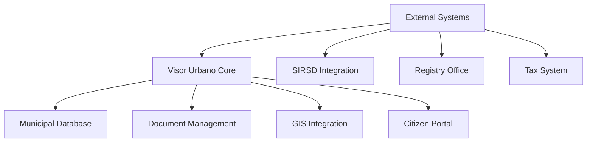

# Integration Guide - Chile

Technical implementation guide for integrating Visor Urbano with Chilean municipal systems and legal requirements.

## Overview

This guide provides step-by-step instructions for implementing Visor Urbano in Chilean municipalities, ensuring compliance with local legal frameworks and integration with existing systems.

## Prerequisites

### Legal Requirements

- Municipal authorization and agreements
- Legal framework compliance verification
- Data protection and privacy compliance
- Professional liability insurance

### Technical Requirements

- Municipal IT infrastructure assessment
- Network connectivity and security
- Integration with existing municipal systems
- Staff training and capacity building

## Integration Architecture

### System Components



### Data Flow

1. **Citizen Application** → Visor Urbano Portal
2. **Document Processing** → Municipal Workflow
3. **Technical Review** → Professional Validation
4. **Legal Verification** → Compliance Check
5. **Final Approval** → Certificate Issuance

## Municipal System Integration

### SIRSD Integration

#### Configuration

```yaml
sirsd_integration:
  endpoint: 'https://sirsd.minvu.cl/api/v1'
  authentication:
    type: 'oauth2'
    client_id: '${SIRSD_CLIENT_ID}'
    client_secret: '${SIRSD_CLIENT_SECRET}'

  sync_procedures:
    - building_permits
    - subdivision_approvals
    - urban_planning_instruments
```

#### Data Mapping

```python
# SIRSD data mapping
SIRSD_MAPPING = {
    'permit_type': {
        'DOM_MAYOR': 'major_building_permit',
        'DOM_MENOR': 'minor_building_permit',
        'SUBDIV': 'subdivision',
        'FUSION': 'lot_fusion'
    },
    'status': {
        'INGRESO': 'submitted',
        'REVISION': 'under_review',
        'APROBADO': 'approved',
        'RECHAZADO': 'rejected'
    }
}
```

### Civil Registry Integration

#### Property Registration

```python
# Property registry integration
class PropertyRegistryService:
    def verify_property_ownership(self, property_id: str, owner_rut: str):
        """Verify property ownership through Civil Registry"""
        response = self.registry_client.get_property(property_id)
        return response.owner_rut == owner_rut

    def update_property_status(self, property_id: str, status: str):
        """Update property status in registry"""
        return self.registry_client.update_status(property_id, status)
```

### Tax System Integration

#### Tax Assessment Updates

```python
# Municipal tax system integration
class TaxSystemService:
    def update_property_assessment(self, property_id: str, new_construction: dict):
        """Update property tax assessment after construction"""
        assessment_data = {
            'property_id': property_id,
            'built_area': new_construction['area'],
            'construction_type': new_construction['type'],
            'estimated_value': new_construction['value']
        }
        return self.tax_client.update_assessment(assessment_data)
```

## Legal Compliance Implementation

### Procedure Compliance

#### Building Permit Workflow

```python
# Chilean building permit compliance
class ChileanBuildingPermitWorkflow:
    def __init__(self):
        self.legal_checks = [
            self.verify_zoning_compliance,
            self.check_minimum_setbacks,
            self.validate_maximum_height,
            self.verify_parking_requirements,
            self.check_accessibility_compliance
        ]

    def process_application(self, application: dict):
        """Process building permit according to Chilean law"""
        for check in self.legal_checks:
            if not check(application):
                return self.reject_application(application, check.__name__)

        return self.approve_application(application)
```

#### Document Requirements

```yaml
document_requirements:
  building_permit:
    mandatory:
      - property_title_deed
      - property_certificate
      - architectural_plans
      - structural_calculations
      - professional_responsibility

    optional:
      - environmental_impact_assessment
      - traffic_impact_study
      - heritage_protection_report
```

### Regulatory Compliance

#### OGUC Compliance

```python
# General Urban Planning Ordinance compliance
class OGUCCompliance:
    def validate_construction_standards(self, plans: dict):
        """Validate against OGUC requirements"""
        checks = {
            'minimum_lot_size': self.check_minimum_lot_size(plans),
            'building_coefficient': self.check_building_coefficient(plans),
            'occupancy_coefficient': self.check_occupancy_coefficient(plans),
            'height_limits': self.check_height_limits(plans),
            'setbacks': self.check_setbacks(plans)
        }
        return all(checks.values()), checks
```

## Geographic Information System (GIS) Integration

### Regional GIS Integration

#### IDE Chile Integration

```python
# Spatial Data Infrastructure integration
class IDEChileService:
    def __init__(self):
        self.wms_endpoint = "https://www.ide.cl/geoserver/wms"
        self.wfs_endpoint = "https://www.ide.cl/geoserver/wfs"

    def get_zoning_layer(self, municipality: str):
        """Get municipal zoning layer"""
        params = {
            'service': 'WMS',
            'version': '1.1.0',
            'request': 'GetMap',
            'layers': f'chile:{municipality}_zoning',
            'format': 'application/json'
        }
        return self.make_request(self.wms_endpoint, params)
```

#### Municipal Cartography

```python
# Municipal cartographic integration
class MunicipalCartographyService:
    def load_municipal_layers(self, municipality_code: str):
        """Load municipal geographic layers"""
        layers = {
            'zoning': self.load_zoning_layer(municipality_code),
            'streets': self.load_street_network(municipality_code),
            'utilities': self.load_utilities_network(municipality_code),
            'protected_areas': self.load_protected_areas(municipality_code)
        }
        return layers
```

## User Management and Authentication

### Municipal User Integration

#### Active Directory Integration

```python
# Municipal Active Directory integration
from ldap3 import Server, Connection

class MunicipalAuthService:
    def __init__(self):
        self.ldap_server = Server('ldap://municipal-ad.local')

    def authenticate_user(self, username: str, password: str):
        """Authenticate municipal user against AD"""
        try:
            conn = Connection(self.ldap_server, username, password)
            if conn.bind():
                return self.get_user_profile(username)
        except Exception as e:
            logger.error(f"Authentication failed: {e}")
        return None
```

#### Role-Based Access Control

```yaml
rbac_configuration:
  roles:
    municipal_inspector:
      permissions:
        - view_applications
        - review_documents
        - schedule_inspections
        - generate_reports

    building_director:
      permissions:
        - approve_permits
        - reject_applications
        - modify_procedures
        - access_statistics

    citizen_service:
      permissions:
        - view_applications
        - update_citizen_data
        - schedule_appointments
        - provide_information
```

## Data Migration and Setup

### Historical Data Migration

#### Permit Records Migration

```python
# Historical permit data migration
class PermitDataMigration:
    def migrate_historical_permits(self, source_db_config: dict):
        """Migrate historical permit data"""
        source_permits = self.extract_permits(source_db_config)

        for permit in source_permits:
            mapped_permit = self.map_permit_data(permit)
            try:
                self.create_visor_urbano_permit(mapped_permit)
                logger.info(f"Migrated permit {permit['id']}")
            except Exception as e:
                logger.error(f"Failed to migrate permit {permit['id']}: {e}")
```

#### Document Digitization

```python
# Document digitization service
class DocumentDigitizationService:
    def digitize_paper_documents(self, document_path: str):
        """Convert paper documents to digital format"""
        # OCR processing
        text = self.ocr_engine.extract_text(document_path)

        # Document classification
        doc_type = self.classify_document(text)

        # Metadata extraction
        metadata = self.extract_metadata(text, doc_type)

        return {
            'type': doc_type,
            'content': text,
            'metadata': metadata,
            'file_path': document_path
        }
```

## Testing and Validation

### Integration Testing

#### System Integration Tests

```python
# Integration test suite
class ChileanIntegrationTests:
    def test_sirsd_integration(self):
        """Test SIRSD system integration"""
        permit_data = self.create_test_permit()
        response = self.sirsd_service.submit_permit(permit_data)
        assert response.status == 'submitted'

    def test_legal_compliance(self):
        """Test legal compliance validation"""
        test_application = self.create_test_application()
        compliance_result = self.compliance_service.validate(test_application)
        assert compliance_result.is_compliant
```

#### Performance Testing

```python
# Performance testing
class PerformanceTests:
    def test_application_processing_time(self):
        """Test application processing performance"""
        start_time = time.time()

        # Process 100 test applications
        for i in range(100):
            self.process_test_application()

        end_time = time.time()
        average_time = (end_time - start_time) / 100

        assert average_time < 5.0  # Maximum 5 seconds per application
```

## Deployment Strategy

### Phase 1: Pilot Implementation

- Single municipality deployment
- Limited procedure types
- Core functionality testing
- User feedback collection

### Phase 2: Regional Rollout

- Multiple municipality deployment
- Full procedure coverage
- System integration validation
- Performance optimization

### Phase 3: National Scaling

- All municipalities integration
- Advanced features deployment
- Continuous monitoring
- Ongoing support

## Monitoring and Maintenance

### System Monitoring

#### Performance Metrics

```python
# System performance monitoring
class PerformanceMonitor:
    def collect_metrics(self):
        """Collect system performance metrics"""
        return {
            'application_processing_time': self.get_avg_processing_time(),
            'system_uptime': self.get_system_uptime(),
            'database_performance': self.get_db_performance(),
            'user_satisfaction': self.get_satisfaction_scores()
        }
```

#### Legal Compliance Monitoring

```python
# Compliance monitoring
class ComplianceMonitor:
    def audit_legal_compliance(self):
        """Audit system for legal compliance"""
        return {
            'procedure_compliance': self.check_procedure_compliance(),
            'document_retention': self.check_document_retention(),
            'citizen_rights': self.check_citizen_rights_compliance(),
            'data_protection': self.check_data_protection_compliance()
        }
```

## Support and Training

### User Training Programs

#### Municipal Staff Training

- System operation procedures
- Legal compliance requirements
- Customer service protocols
- Technical troubleshooting

#### Citizen Education

- Online application procedures
- Document requirements
- Status tracking usage
- Support channel access

### Technical Support

#### Support Levels

1. **Level 1**: Basic user support and guidance
2. **Level 2**: Technical issue resolution
3. **Level 3**: System administration and development

#### Support Channels

- Phone support: Municipal hotline
- Email support: Technical assistance
- Online portal: Self-service options
- On-site support: Critical issues

## Next Steps

- Review implementation best practices and configuration guides
- Check [Legal Framework](./legal-framework-chile.md)
- Explore configuration examples and best practices
- Follow [API Integration Guide](../development/api-integration.md)
